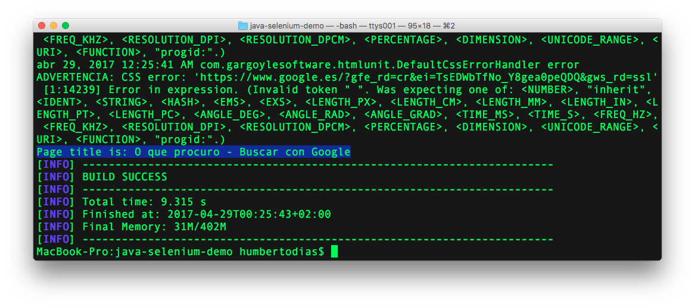

# Java con Selenium

Aplicación Java usando Selenium con HTMLUtil y PhantomJS


## Prerequisitos

1. [Maven](https://maven.apache.org/download.cgi) 3+
2. [Java](http://www.oracle.com/technetwork/pt/java/javase/downloads/index.html) 8+
3. [PhantonJS](http://phantomjs.org/download.html) 2+

## Como correr

1. Clon

	```
	git clone https://github.com/humbertodias/java-selenium-demo.git
	```

2. Entrar en la carpeta

	```
	cd java-selenium-demo
	```

3. Correr 

	en terminal
	
	```
	mvn exec:java -Dexec.mainClass="htmldriver.HtmlUnitTest"
	```
	
	o
	
	```
	mvn exec:java -Dexec.mainClass="htmldriver.PhantomJSTest"
	```




## Referencias

[Selenium Example](http://www.guru99.com/selenium-with-htmlunit-driver-phantomjs.html)